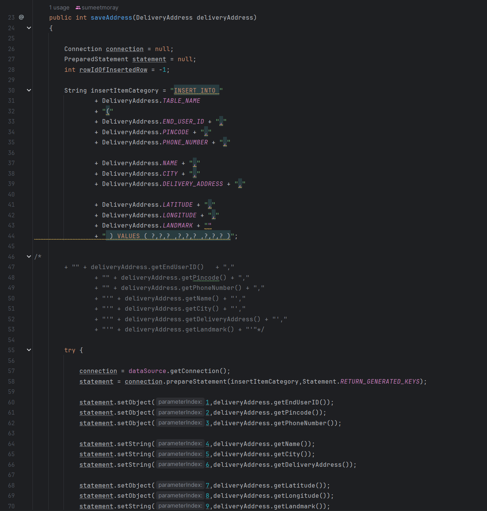
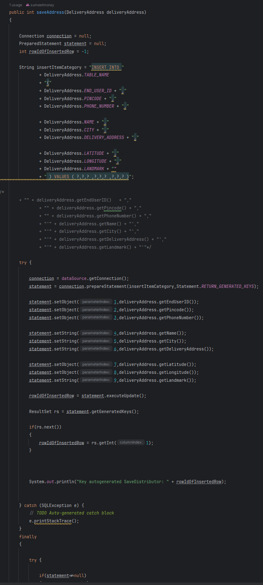

# Introducción
Este proyecto es una API que permite, en terminos generales, encontrar restaurantes cercanos.

Este proyecto sera usado a lo largo del curso de **Calidad de Software y Gestion de Deuda Tecnica** para ser analizado y
poner en practica todos los conceptos que sean vistos a lo largo del curso.

El proyecto esta construido con las siguientes tecnologias:
- Java 8
- Spring Boot - Maven
- PostgreSQL

# Code Smells y Refactoring
## Code Smells
### 1. Codigo Comentado
En varios puntos del proyecto se puede encontrar codigo comentado que no aporta nada el proyecto, no aporta una
funcionalidad nueva o algo por el estilo. A continuacion se veran algunos de estos **Code Smells** identificados.

#### 1.1. Clase `DAOAddBalance`


#### 1.2. Clase `CartItemService`


#### 1.3. Clase `CartStatsDAO`


#### 1.4. Clase `DeliveryAddressService`


### 2. Funciones largas y Funciones con muchos parametros/funciones
A lo largo del proyecto se evidencian multiples metodos/funciones que son muy largas, o poseen muchos metodos o tienen
mas de una sola funcion que va en contra de algunos de los principios *SOLID* y *OOP*.

#### 2.1 Clase `DeliveryAddressService`


#### 2.2 Clase `FavouriteShopResource`


#### 2.4 Clase `ShopItemByShopDAO`


## Tecnicas de Refactoring
### 1. Clean Architecture
Se propone la implementacion de una arquitectura limpia para una mejor organizacion de paquetes y entendimiento del 
proyecto.


Se propone re-organizar todo en la siguiente estructura siguiendo los principios de *Arquitectura Hexagonal*:
``` shell
.
|- src
   |- main
        |- java
             |- org.nearbyshops
                |- adapters
                   |- in
                   |- out
                |- application
                   |- services
                   |- ports
                      |- in
                      |- out
                |- domain
                |- Main.java
```

### 2. Eliminar elementos no usados
Los siguientes metodos y funciones son aquellos que no aperantan tener un uso deprecado:

#### 2.1 Clases
- `ItemBrand`
- 
#### 2.2 Metodos
- `MetodogetTimestampHDDelivered`
- `getDeliveryGuyData`
- `getReasonCancelledByShop`
- `getReasonForOrderReturned`
- `getRt_delivery_guy_profile`

### 3. Separaciion de responsabilidades
Se propone la separacion de responsabilidades en todos los paquetes *DAO* ya que estos cuentan tanto con logica como
con logica de acceso a datos, que siguiendo un esquema de *Clean Architecture*, para temas relacionados con escalabilidad
y mantenibilidad estos accesos deben estar separados y conectados mediante interfaces.