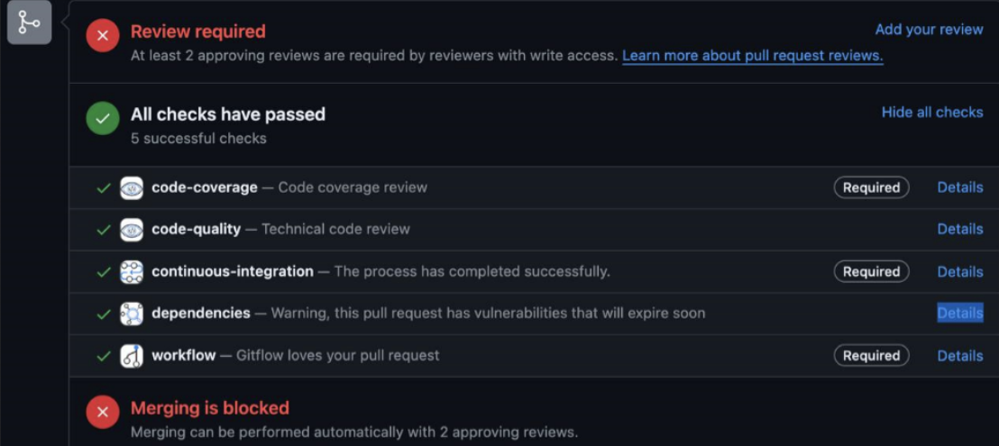
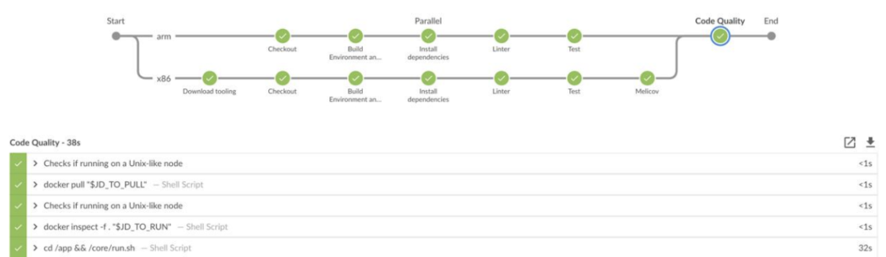

# CI/CD
Como parte de hacer una mejora en las buenas practicas que se deben seguir a la hora de realizar un feature, fix, hotfix o simplemente una refactorización del proyecto, se realizo una integracion con de las herramientas de Jenkins y SonarQube junto con GitHub actions para impedir que se dañen a futuro cosas que se hayan agregado nuevas o que se hayan arreglado. Para esto se uso el siguiente script:
```yaml
name: CI/CD

on:
  push:
    branches:
      - *

jobs:
  build:
    runs-on: ubuntu-latest

    steps:
      # Paso 1: Validar el workflow (Gitflow)
      - name: Check out code
        uses: actions/checkout@v2

      # Paso 2: Compilar el proyecto Java
      - name: Set up JDK 11
        uses: actions/setup-java@v2
        with:
          java-version: '11'
      - name: Build with Maven
        run: mvn -B package --file pom.xml

      # Paso 3: Ejecutar pruebas
      - name: Run tests
        run: mvn test

      # Paso final: Integración con Jenkins
      - name: Trigger Jenkins job
        uses: appleboy/jenkins-action@master
        with:
          url: ${{ secrets.JENKINS_URL }}
          username: ${{ secrets.JENKINS_USERNAME }}
          password: ${{ secrets.JENKINS_PASSWORD }}
          job: 'nearby-shops-job'
```

Gracias a esto se genero un excelente pipeline que permitia la validacion de pruebas unitarias, buen manejo del GitFlow y calidad de codigo.





Esto, ademas de permitirnos validar que todo aquel codigo nuevo que se vaya a añadir sea automaticamente verificado por las herramientas anteriormente mencionadas, busca tener reglas de integracion como se muestra en la primera imagen, en donde dos compañeros de equipo deben de aprobar los cambios que se añadiran, lo cual hara que se tenga una mayor seguridad a la hora de realizar estas integraciones.

[🏠 Índice](./index.html) | [🔙](./github-actions.html) 

