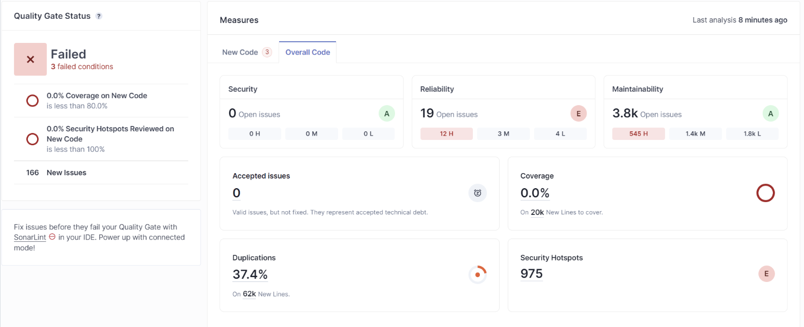

# 🚦 Static Analysis
SonarQube arrojo los siguientes resultados para el proyecto Nearby Shops:

Luego de algunas acciones de refactorización y corrección de errores, los resultados mejoraron:

## 📊 Resumen
- 37.4% de código duplicado.
- 975 problemas de seguridad.
- +4000 problemas de mantenibilidad.
- 19 problemas de fiabilidad.

## 📝 Detalles
Con las acciones tomadas anteriormente, debido a la gigantesca deuda técnica que tiene el proyecto, la cantidad de
efuerzo necesario para reducir la mayor parte de los issues reportados por **SonarQube** es bastante alto.

Adicionalmente, con la ausencia de pruebas unitarias, el modificar algo da temor como desarrollador ya que no se
garantiza que el comportamiento de las funcionalidades presentes en el proyecto se mantengan.

Por un lado, no se presentan bugs a la hora de usar la aplicación, pero por otro lado, el garantizar que no se vayan a
presentar algunos bugs unas vez se tome como accion principal la separación del monolito es completamente imposible.

Como desarrollador, al ver este proyecto y realizar los analisis que se han venido haciendo a lo largo del curso veo la
importancia de mantener una deuda tecnica casi nula en cada proyecto que se trabaje para garantizar la mantenibilidad
de los mismos y evitar situaciones como la que estoy viviendo con la reduccion de deuda tecnica en este proyecto.

 |  | 
